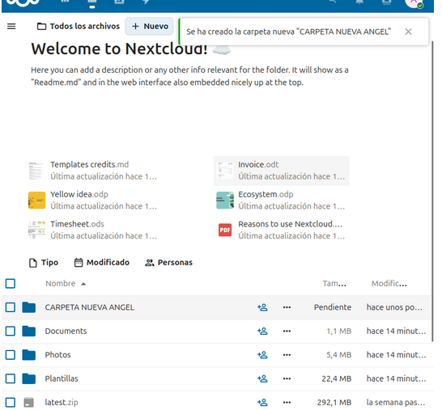
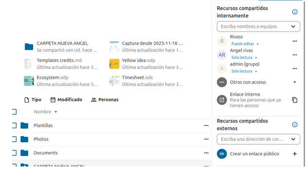
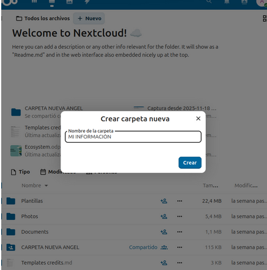
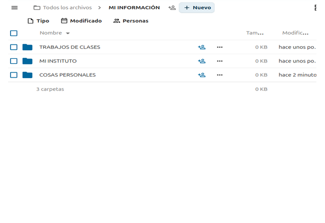
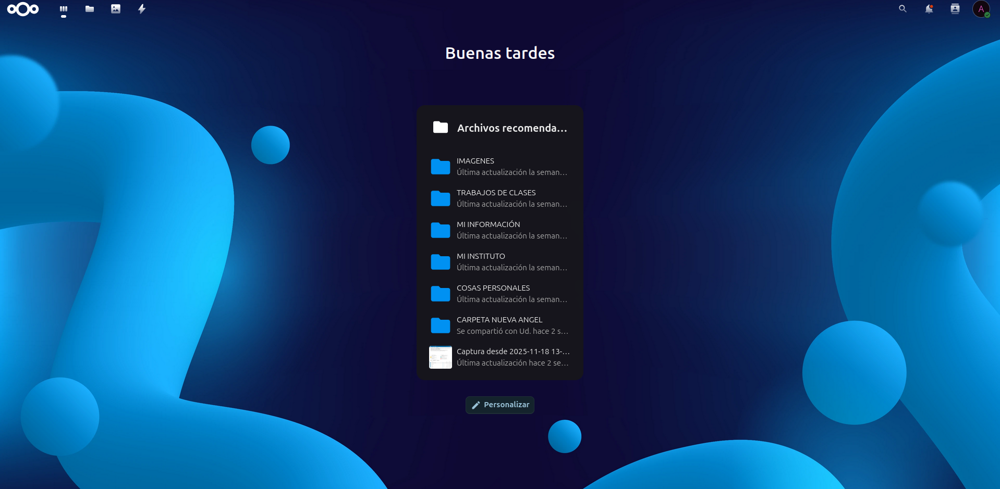

## Demostració del funcionament

En la primera imatge comprovem el funcionament del programa.

## Creació de la carpeta

Para crear una carpeta hay que hacer lo mismo que en lo de subir un archivo le damos al + nuevo y te saldrá la opción de crear nueva carpeta.

## Carpeta compartida

Una vegada ja tinguis la carpeta creada per a compartir-la li hauràs de donar a una persona que té un + a dalt.

## Creació de usuarios

Aquí tenim els usuaris creats als quals li anem compartir la presentació.

## Assignació de rols i permisos

----------------------------------------
## Organització de carpetes i fitxers

---------------------------------------------
## Accés des d’una màquina qualsevol de la xarxa

